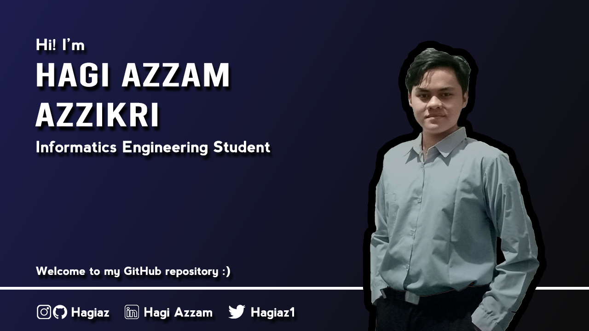

  

<h1 align="center">Hi 👋, I'm Hagi Azzam Azzikri</h1> 

I'm currently an informatics engineering student at Singaperbangsa Karawang University, Indonesia. I'm currenntly learning <code>Web Development</code>, <code>Cloud Computing</code> and <code>Machine Learning</code>. Beside that, I'm also interested in <code>Data science</code> and <code>Mobile development</code>.

I like to read, watch youtube and play games and sports. And also, i like to explore new things everyday, especially IT-related things.

- 📫 How to reach me : **hagiazzam@gmail.com** or

  
  
  

__Check out my repository:__

  

    
  

## Connect With Me

## Languages And Tools

  

 

  

## My GitHub Stats

